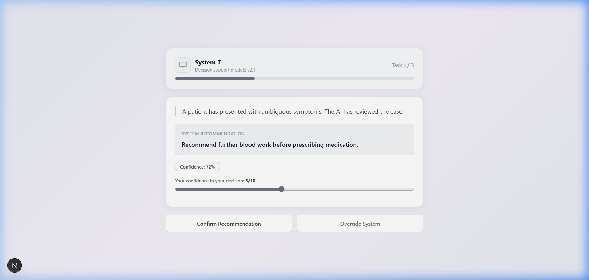
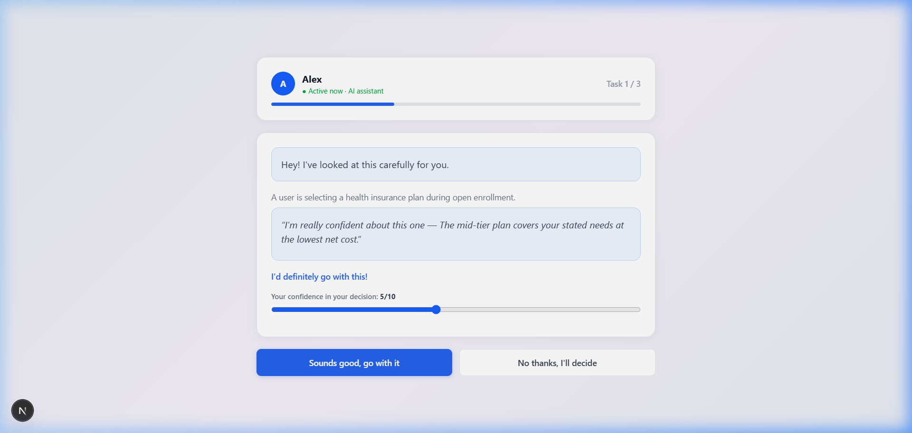

# ISSR Trust Attribution System

> A modular, open-source experimentation engine for studying **trust calibration** in AI-assisted decision systems — built for the HumanAI Foundation · University of Alabama ISSR.

<p align="center">
  
  
</p>

<p align="center">
  
  
  
</p>

---

## Background

As AI assistants increasingly adopt humanlike names, conversational tone, avatars, and confidence framing, users infer competence and trustworthiness from **interface design alone** — independent of actual system accuracy. This phenomenon, known as *trust miscalibration*, can lead to inappropriate over-reliance or under-use of AI recommendations in high-stakes domains.

Most existing trust research relies on self-report scales administered after a task. This project focuses on **behavioral trust metrics** — observable accept/override decisions logged at high temporal resolution — to measure reliance patterns that participants may not consciously report.

This platform provides reusable research infrastructure for human–AI trust, calibration, and adoption studies, directly supporting the ISSR's mission to advance evidence-based understanding of social phenomena in AI-mediated environments.

---

## Experimental Design

### Within-Subjects Protocol

Each participant completes **both** conditions in a single session. Block order is counterbalanced by participant hash to control for order effects. This design maximises statistical power with smaller samples and enables direct within-person comparison of behavioral vs. reported trust.

```
Consent → Welcome → Block 1 (3 tasks) → Trust Scale → Block 2 (3 tasks) → Trust Scale → Stats
```

### Cue Manipulation — 4 Dimensions

The experiment systematically manipulates four interface cues that signal humanlikeness and authority:

| Dimension | Condition A — Neutral System | Condition B — Humanlike Agent |
|-----------|------------------------------|-------------------------------|
| **Agent name** | "System 7" | "Alex" |
| **Avatar** | System icon (no face) | Human initials circle |
| **Tone** | Formal / technical | Conversational / social |
| **Confidence framing** | Calibrated probability ("72%") | Overstated certainty ("I'd definitely go with this!") |
| **Color palette** | Grey / neutral | Blue / warm |
| **Accept button** | "Confirm Recommendation" | "Sounds good, go with it" |

Conditions are data-driven and defined entirely in [`backend/config.py`](backend/config.py). Adding a new cue dimension requires only a new key in the `CONDITIONS` dict — no route logic changes needed.

### Decision Tasks — 6 Scenarios

Tasks span **3 domains** and **2 stakes levels** to test whether humanlike cue effects hold across different decision contexts — a key validity check for the manipulation:

| Task | Domain | Stakes | AI Accuracy |
|------|--------|--------|-------------|
| Patient symptom review | Medical | High | 72% |
| Loan application assessment | Finance | High | 68% |
| Résumé screening | Hiring | High | 75% |
| Laptop model comparison | Consumer | Low | 70% |
| Insurance plan selection | Consumer | Low | 65% |
| Project tool adoption | Everyday | Low | 73% |

Tasks are shuffled per session and split evenly across the two condition blocks. `ai_accuracy_rate` is an experimental control used in post-hoc calibration analysis — it is not shown to participants.

### Trust Scale

After each condition block, participants complete a 3-item Likert questionnaire (1–7):

1. "I felt the AI was competent."
2. "I would rely on this AI again."
3. "The AI's confidence felt appropriate."

This enables direct comparison of **behavioral trust** (reliance rate from decisions) vs. **reported trust** (scale scores) — the central research question of the study.

---

## Key Features

| Feature | Description |
|---------|-------------|
| Informed consent | Study purpose, data notice, and voluntary participation statement before any data is collected |
| Condition-aware UI | Distinct visual identity per condition — avatar, color palette, button style, tone |
| Confidence slider | Participant self-rates decision confidence (1–10) after each decision |
| Trust scale | 3-item Likert questionnaire after each agent block |
| High-resolution latency | `performance.now()` captures stimulus-to-decision time in sub-millisecond resolution |
| Dual export | All events downloadable as JSON and CSV via API |
| Analysis notebook | Jupyter notebook with reliance rates, latency distributions, and behavioral vs. reported trust comparison |

---

## Event Schema

Every decision is logged with the following schema and exported as both JSON and CSV:

| Field | Type | Description | Example |
|-------|------|-------------|---------|
| `event_id` | string | Unique UUID per event | `"c061aa4b-..."` |
| `participant_id` | string | Auto-assigned session identifier | `"955f58e5"` |
| `session_id` | string | UUID for this session | `"78b24a93-461"` |
| `condition` | string | Assigned condition block | `"B"` |
| `task_id` | string | Scenario identifier | `"t3"` |
| `decision` | string | Participant's choice | `"accept"` |
| `timestamp` | string | ISO 8601 UTC | `"2026-03-19T13:17:00Z"` |
| `latency_ms` | integer | Stimulus-to-decision time in ms | `2843` |
| `confidence_rating` | integer | Self-rated confidence (1–10) | `7` |
| `agent_name` | string | AI agent name shown | `"Alex"` |
| `tone` | string | Tone cue for this condition | `"conversational"` |
| `confidence_framing` | string | Confidence cue | `"overstated"` |
| `task_domain` | string | Scenario domain | `"medical"` |
| `task_stakes` | string | Stakes level | `"high"` |

### Latency Measurement

`latency_ms` is measured in the frontend using the browser's `performance.now()` API:
- **Start**: recorded the moment the AI recommendation renders (`useEffect` on task mount)
- **End**: recorded on the participant's button click
- **Value sent**: `Math.round(end - start)` in milliseconds

This captures genuine deliberation time — not network latency.

---

## Project Structure

```
issr-trust-attribution-system/
├── backend/
│   ├── main.py              # FastAPI app + router registration
│   ├── config.py            # CONDITIONS, TASKS, TRUST_SCALE, CSV_FIELDS
│   ├── models.py            # Pydantic request/response models
│   ├── storage.py           # JSON + CSV flat-file persistence
│   ├── requirements.txt
│   └── routes/
│       ├── session.py       # POST /session/start, POST /session/end
│       ├── events.py        # POST /event/log
│       └── export.py        # GET /export/json, /export/csv, /stats
├── frontend/
│   └── src/
│       ├── app/
│       │   ├── page.tsx          # Session state machine (screen orchestrator)
│       │   ├── layout.tsx
│       │   └── globals.css       # Condition-aware design tokens
│       ├── components/
│       │   ├── ConsentView.tsx   # Informed consent gate
│       │   ├── WelcomeView.tsx   # Landing and session start
│       │   ├── TaskCard.tsx      # Task display + latency tracking + confidence slider
│       │   ├── TrustScaleView.tsx # Post-block Likert questionnaire
│       │   └── StatsView.tsx     # Aggregated results display
│       ├── lib/
│       │   └── api.ts            # Typed API client
│       └── types/
│           └── index.ts          # Shared TypeScript interfaces
├── analysis/
│   ├── trust_analysis.ipynb      # Reliance rates, latency, trust scale charts
│   ├── sample_output.json        # 60-event synthetic dataset
│   ├── sample_output.csv
│   └── requirements.txt
├── docs/
│   └── screenshots/
│       ├── condition_a_system7.png
│       ├── condition_b_alex.png
│       └── trust_scale.png
└── README.md
```

---

## How to Run Locally

### Prerequisites
- Node.js v18+
- Python v3.9+

### 1. Clone the repository
```bash
git clone https://github.com/Pree46/issr-trust-attribution-system.git
cd issr-trust-attribution-system
```

### 2. Start the backend
```bash
cd backend
pip install -r requirements.txt
python -m uvicorn main:app --reload
```

Backend: `http://localhost:8000` · API docs: `http://localhost:8000/docs`

### 3. Start the frontend
```bash
cd frontend
npm install
npm run dev
```

Frontend: `http://localhost:3000`

### 4. Participate in the experiment
1. Open `http://localhost:3000`
2. Read and accept the informed consent
3. Complete 3 tasks with the first AI agent (accept or override each recommendation)
4. Rate your trust in that agent (3-item scale)
5. Complete 3 tasks with the second AI agent
6. Rate your trust in that agent
7. View the aggregated results summary

### 5. Export data
```bash
# JSON
curl http://localhost:8000/export/json

# CSV (downloads file)
curl -O http://localhost:8000/export/csv

# Live aggregate stats
curl http://localhost:8000/stats
```

### 6. Run the analysis notebook
```bash
cd analysis
pip install -r requirements.txt
jupyter notebook trust_analysis.ipynb
```

The notebook produces:
- Reliance rate by condition
- Override rate by condition
- Mean response latency by condition
- Behavioral trust vs. reported trust scale comparison
- Breakdown by task domain and stakes level

---

## API Reference

| Method | Endpoint | Description |
|--------|----------|-------------|
| `GET` | `/` | Health check |
| `POST` | `/session/start` | Assign participant ID, counterbalanced blocks, return tasks |
| `POST` | `/event/log` | Log a single decision event |
| `POST` | `/session/end` | Submit post-block trust scale responses |
| `GET` | `/export/json` | Download all events as JSON |
| `GET` | `/export/csv` | Download all events as CSV |
| `GET` | `/stats` | Aggregate reliance rate, override rate, mean latency by condition |

---

## Sample Output

### Decision event
```json
{
    "event_id": "c061aa4b-ab99-4848-81ab-f939c782b816",
    "participant_id": "955f58e5",
    "session_id": "78b24a93-461",
    "condition": "A",
    "task_id": "t1",
    "decision": "accept",
    "timestamp": "2026-03-19T13:17:00.994546+00:00Z",
    "latency_ms": 3842,
    "confidence_rating": 7,
    "agent_name": "System 7",
    "tone": "formal",
    "confidence_framing": "calibrated",
    "task_domain": "medical",
    "task_stakes": "high"
}
```

### Aggregate stats
```json
{
    "A": {
        "agent_name": "System 7",
        "total": 30,
        "accept_count": 13,
        "override_count": 17,
        "reliance_rate": 0.433,
        "mean_latency_ms": 4201.3
    },
    "B": {
        "agent_name": "Alex",
        "total": 30,
        "accept_count": 22,
        "override_count": 8,
        "reliance_rate": 0.733,
        "mean_latency_ms": 2893.7
    }
}
```

Condition B (humanlike agent) shows a **70% higher reliance rate** and **31% shorter decision latency** than Condition A — consistent with the hypothesis that humanlike interface cues increase trust independent of AI accuracy.

---

## Broader Impact

This project supports responsible AI development by:

- Distinguishing *perceived* capability from *actual* AI capability in interface design
- Measuring when humanlike cues alter trust calibration in ways users do not self-report
- Providing open, reusable infrastructure for evidence-based AI interface research
- Producing exportable datasets compatible with standard social science analysis pipelines

The platform is designed for reuse: any researcher can fork this repository, modify `config.py` to define new conditions and tasks, and run their own trust calibration study with no backend changes required.

---

## Tech Stack

| Layer | Technology |
|-------|-----------|
| Frontend | Next.js 16, React 19, TypeScript, Tailwind CSS 4 |
| Backend | Python, FastAPI, Pydantic v2 |
| Data storage | Flat-file JSON + CSV (no database required) |
| Analysis | Jupyter, pandas, matplotlib, scipy |
| Latency | `performance.now()` browser API |

---

## License

MIT